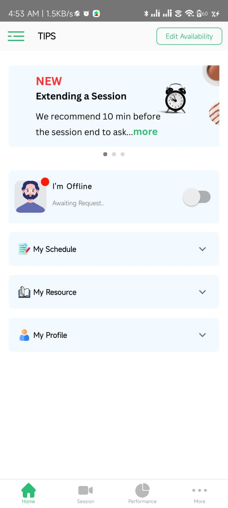
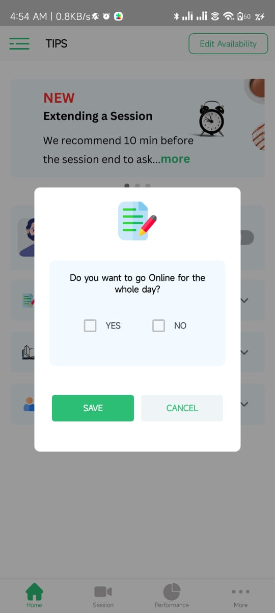
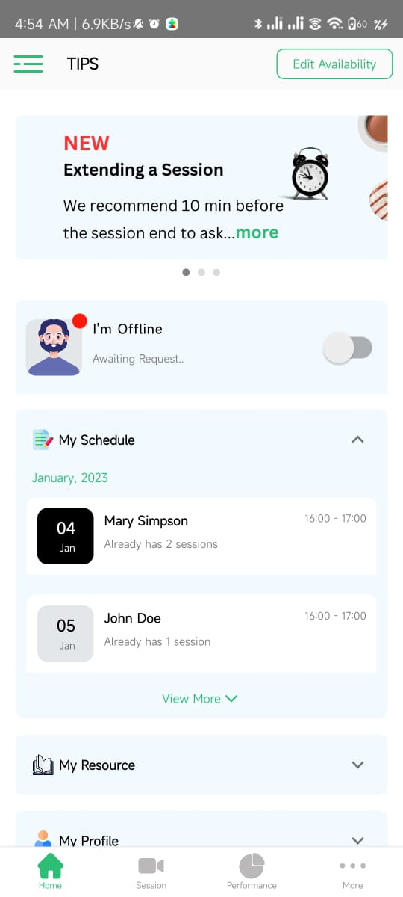

# React-Native Company Portal

A mobile portal for company associates to manage their sessions, schedules, resources, and profile. This app is built with React Native and designed for ease of use, focusing on real-time availability and schedule management.

---

## Features

- **Home Dashboard**: Quick view of your availability, schedule, resources, and profile.
- **Session Availability**: Toggle your online status and control your session availability for the day.
- **Schedule Management**: View upcoming sessions and detailed scheduling information.
- **Resource Access**: Access important company resources from within the app.
- **Profile Management**: Manage and update your profile details.

---

## App Screenshots

> _Place these images in an `assets` folder at the root of your repository._

### Home Dashboard


### Go Online Confirmation


### Schedule View


---

## Deployment

To deploy and run this project locally:
```bash
npx react-native start
```
then in a separate terminal:
```bash
npx react-native run-android
```

---

## Packages and Libraries Used

- [`react-native-elements`](https://reactnativeelements.com/)
- [`@react-navigation/native`](https://reactnavigation.org/)
- [`react-native-vector-icons`](https://github.com/oblador/react-native-vector-icons)
- [`react-redux`](https://react-redux.js.org/)
- [`redux`](https://redux.js.org/)
- [`@react-native-async-storage/async-storage`](https://github.com/react-native-async-storage/async-storage)
- [`axios`](https://axios-http.com/)
- [`moment`](https://momentjs.com/)
- [`@react-native-community/netinfo`](https://github.com/react-native-netinfo/react-native-netinfo)
- [`@react-native-community/masked-view`](https://github.com/react-native-masked-view/masked-view)
- [`@react-navigation/stack`](https://reactnavigation.org/docs/stack-navigator/)
- **and more...** (see `package.json` for a full list)

---

## Documentation

For more details and complete documentation, visit:  
[Documentation](https://linktodocumentation)

---

## License

[MIT](LICENSE)
